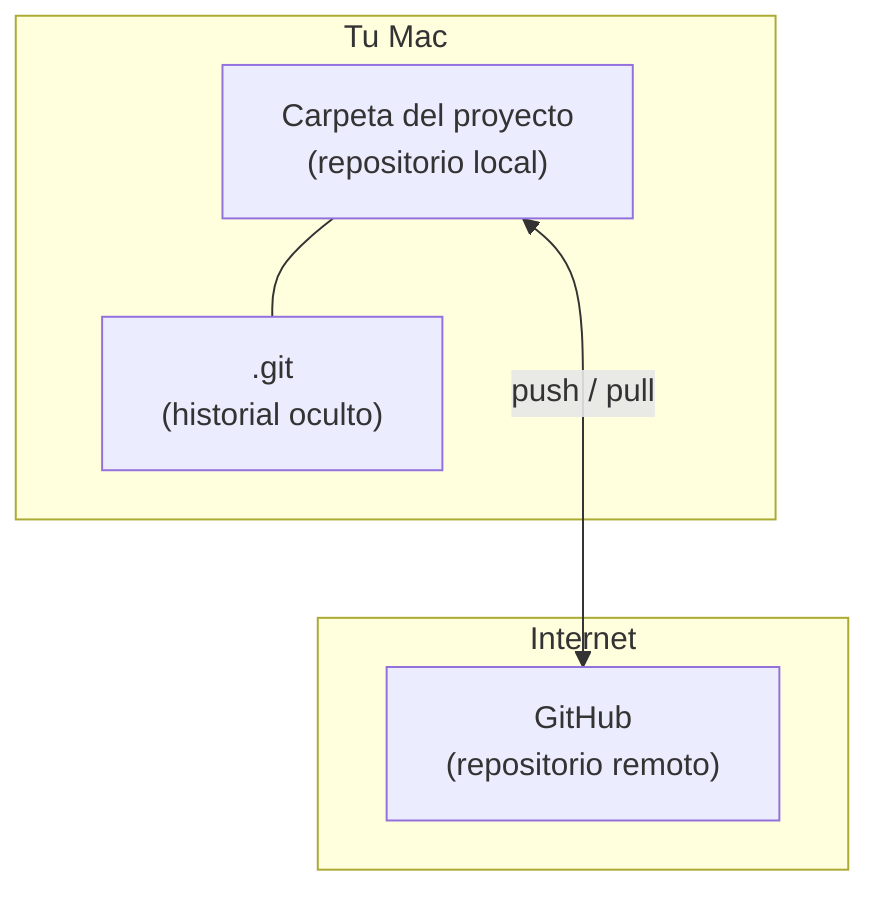
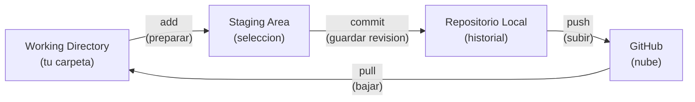
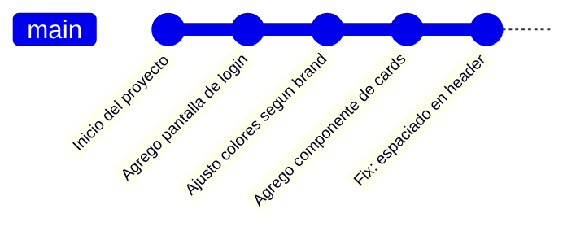
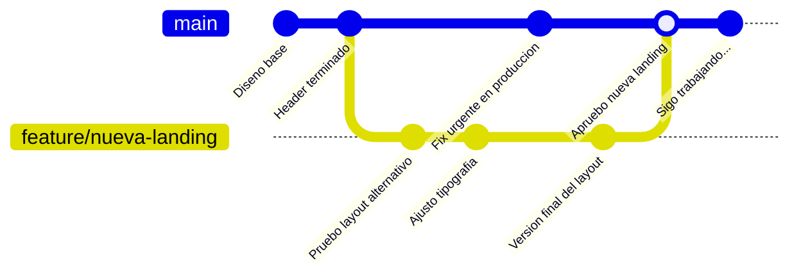
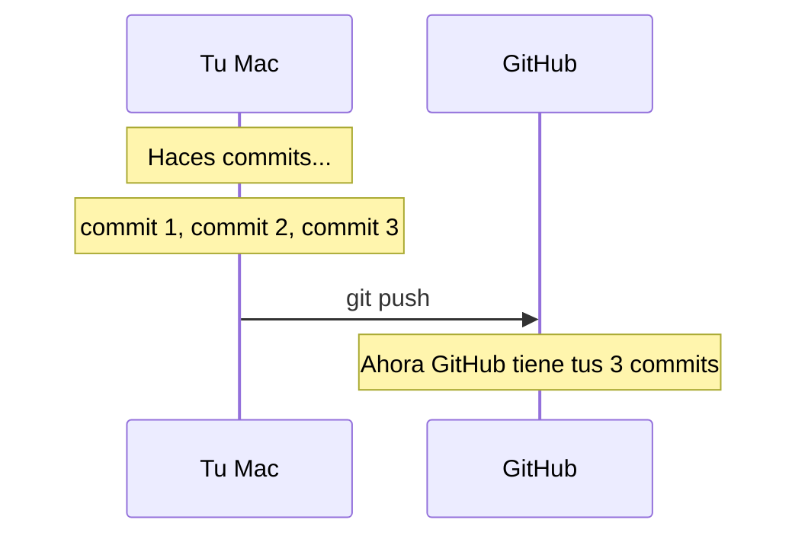
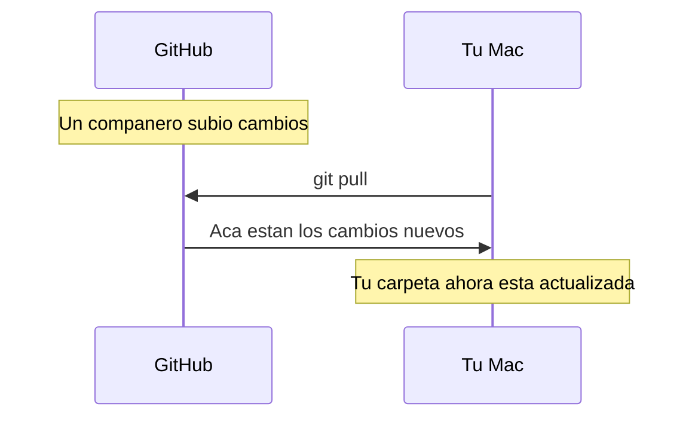
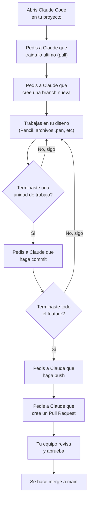
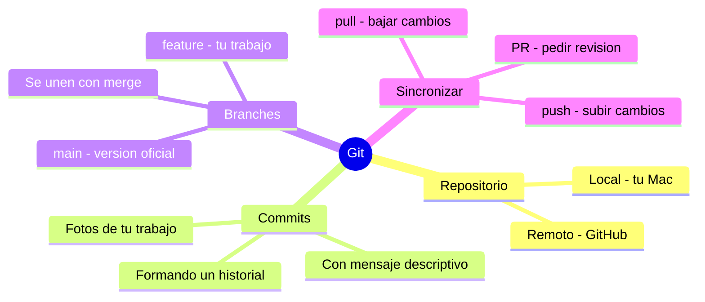
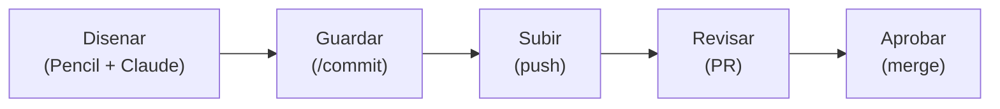

# Git y GitHub: Guia Practica para Disenadores

---

## Antes de empezar

Esta guia esta pensada para que entiendas **como funciona Git**, **por que existe** y **cuando usar cada cosa**. No necesitas memorizar comandos: Claude Code se encarga de ejecutarlos por vos. Lo que necesitas es entender el modelo mental para poder darle instrucciones claras.

Pensalo asi: no necesitas saber operar una impresora 3D para disenar la pieza. Pero si necesitas entender que es una pieza, que es un material y como funciona el proceso para que tu diseno sea imprimible.

---

## Tabla de contenidos

1. [Que es Git y por que existe](#1-que-es-git-y-por-que-existe)
2. [El modelo mental: anatomia de un repositorio](#2-el-modelo-mental-anatomia-de-un-repositorio)
3. [Los 4 espacios donde vive tu trabajo](#3-los-4-espacios-donde-vive-tu-trabajo)
4. [Commits: el corazon de Git](#4-commits-el-corazon-de-git)
5. [Branches: variantes de diseno](#5-branches-variantes-de-diseno)
6. [Sincronizacion: push, pull y el trabajo en equipo](#6-sincronizacion-push-pull-y-el-trabajo-en-equipo)
7. [El flujo completo de trabajo](#7-el-flujo-completo-de-trabajo)
8. [Conflictos: cuando dos personas tocan lo mismo](#8-conflictos-cuando-dos-personas-tocan-lo-mismo)
9. [Como usar todo esto con Claude Code](#9-como-usar-todo-esto-con-claude-code)
10. [Escenarios reales del dia a dia](#10-escenarios-reales-del-dia-a-dia)
11. [Ejercicios practicos](#11-ejercicios-practicos)
12. [Referencia rapida](#12-referencia-rapida)
13. [Glosario visual](#13-glosario-visual)

---

## 1. Que es Git y por que existe

### El problema que resuelve

Seguro conoces esto en Figma:

```
diseno-landing-v1.fig
diseno-landing-v2.fig
diseno-landing-v2-final.fig
diseno-landing-v2-final-FINAL.fig
diseno-landing-v2-final-FINAL-ahora-si.fig
```

Figma lo resolvio con su historial de versiones integrado. Pero fuera de Figma — archivos `.pen`, documentos, configuraciones de Webflow, assets — no existe ese historial automatico.

**Git es un sistema de control de versiones.** Registra cada cambio que haces en tus archivos, quien lo hizo, cuando, y por que. Es como el historial de versiones de Figma, pero para **cualquier tipo de archivo** y con bastante mas control.

### Por que tu jefe quiere que lo uses

- **Tus archivos `.pen` de Pencil** no tienen un historial de versiones en la nube como Figma. Git te da ese historial.
- **Trabajo en equipo**: si alguien mas necesita ver o modificar tus archivos, Git coordina eso sin que se pisen.
- **Respaldo profesional**: todo queda guardado en GitHub (la nube). Si tu Mac explota, tu trabajo esta a salvo.
- **Trazabilidad**: tu jefe puede ver que cambio, cuando y por que. Esto es estandar en empresas tech como Filadd.

### La analogia del edificio

Vos como arquitecta sabes que un edificio no se construye sin planos, y los planos tienen revisiones. Imaginate esto:

| Concepto arquitectonico | Equivalente en Git |
|---|---|
| El set completo de planos del edificio | El **repositorio** |
| Una revision sellada de los planos ("Rev. 3 - se agrego balcon") | Un **commit** |
| Una propuesta alternativa de fachada para evaluar | Una **branch** (rama) |
| Aprobar la propuesta e incorporarla a los planos oficiales | Un **merge** |
| La copia de los planos en el estudio | Tu **repositorio local** |
| La copia oficial en el archivo municipal | El **repositorio remoto** (GitHub) |

---

## 2. El modelo mental: anatomia de un repositorio

Un **repositorio** (o "repo") es simplemente una carpeta de tu computadora que Git esta vigilando. Dentro de esa carpeta, Git lleva un registro invisible de todos los cambios.



- **Repositorio local**: la carpeta en tu Mac. Trabajas aca.
- `.git`: una carpeta oculta que Git crea automaticamente. Ahi guarda todo el historial. **Nunca la toques.**
- **Repositorio remoto (GitHub)**: la copia en la nube. Sirve como respaldo y como punto de encuentro si trabajas con otros.

> **Dato clave**: Git funciona **offline**. Podes hacer commits sin internet. Solo necesitas internet para subir (push) o bajar (pull) cambios de GitHub.

---

## 3. Los 4 espacios donde vive tu trabajo

Presta atencion aca. En Git, tus archivos pueden estar en 4 lugares logicos:



### Analogia: preparar una entrega de diseno

Imaginate que estas preparando una entrega para un cliente:

| Etapa | En diseno | En Git |
|---|---|---|
| 1. Tenes todos tus archivos en tu escritorio, algunos terminados, otros a medio hacer | Tu carpeta de trabajo | **Working Directory** |
| 2. Seleccionas solo los archivos terminados y los pones en una carpeta "Para entregar" | Elegir que va en la entrega | **Staging Area** (git add) |
| 3. Cerras la carpeta, le pones una etiqueta "Entrega v3 - Homepage aprobada" y la guardas en el archivo | Sellar la entrega | **Commit** |
| 4. Subis esa entrega al Drive compartido del equipo | Compartir con el equipo | **Push** a GitHub |

### Por que existe el Staging Area?

Porque a veces modificas 10 archivos pero solo queres guardar los cambios de 3. El staging area te deja **elegir que entra en cada commit**.

Es como cuando en Figma exportas assets: no exportas todo el archivo, seleccionas que frames exportar. Aca es igual.

---

## 4. Commits: el corazon de Git

Un **commit** es una foto instantanea de tus archivos en un momento dado. Cada commit tiene:

- Un **identificador unico** (un codigo tipo `a3f2b91`)
- Un **mensaje** que describe que cambiaste y por que
- La **fecha y hora**
- El **autor**
- Un puntero al **commit anterior** (formando una cadena)



### Cuando hacer un commit?

La respuesta corta: **hace un commit cuando completaste una unidad logica de trabajo.**

| Buen momento para commitear | Mal momento para commitear |
|---|---|
| Terminaste el diseno de un componente | A mitad de un componente que no funciona |
| Corregiste un error de espaciado | Mezclaste 15 cambios sin relacion |
| Agregaste una nueva pantalla completa | "Por las dudas" sin haber terminado nada |
| Actualizaste los colores del design system | Junto con cambios de otra cosa que no tiene nada que ver |

**Regla de oro**: si podes describir tu commit en una oracion clara, es un buen commit.

### Como escribir buenos mensajes de commit

El mensaje de commit es como la etiqueta de una revision de planos. Tiene que ser claro para que en 3 meses sepas que hiciste.

**Buenos mensajes:**
- `agrego pantalla de onboarding para nuevos usuarios`
- `corrijo espaciado entre cards en la vista de dashboard`
- `actualizo paleta de colores segun nueva guia de marca`
- `agrego variantes mobile del componente de navegacion`

**Malos mensajes:**
- `cambios` (que cambios??)
- `fix` (fix de que??)
- `wip` (trabajo en progreso... pero de que?)
- `asdfg` (...)

> **Tip**: Claude Code te va a ayudar a generar mensajes de commit. Pero es bueno que sepas revisarlos y ajustarlos si hace falta.

---

## 5. Branches: variantes de diseno

Una **branch** (rama) es una linea paralela de trabajo. Te permite experimentar sin afectar la version principal.

### Analogia directa con Figma

En Figma, cuando queres probar una variante de diseno, probablemente dupliques la pagina o el frame. Trabajas en la copia, y si te gusta, moves los cambios a la version principal. Si no te gusta, borras la copia.

**Eso exactamente es una branch.**



### Las branches que necesitas conocer

| Branch | Para que sirve | Analogia |
|---|---|---|
| `main` | La version oficial y estable | Los planos aprobados del edificio |
| `feature/nueva-pantalla` | Desarrollar algo nuevo | Un boceto alternativo en otra hoja |
| `fix/error-en-header` | Corregir algo puntual | Una fe de erratas |

### El ciclo de vida de una branch

1. **Creas** una branch nueva desde `main`
2. **Trabajas** en ella (haces commits)
3. **Pedis revision** (Pull Request en GitHub)
4. **Se aprueba** y se hace merge a `main`
5. **Se elimina** la branch (ya no la necesitas)

> **Importante**: en Filadd, lo mas probable es que te pidan trabajar siempre en branches y nunca directamente en `main`. Esto es una practica estandar.

---

## 6. Sincronizacion: push, pull y el trabajo en equipo

### Push: subir tus cambios

Cuando haces commits, esos cambios viven **solo en tu Mac**. Para que esten en GitHub (y tu jefe o tu equipo los vean), necesitas hacer **push**.



**Cuando hacer push:**
- Terminaste una sesion de trabajo y queres respaldar
- Queres que alguien revise tu trabajo
- Antes de cerrar la laptop

### Pull: bajar cambios de otros

Si alguien mas hizo cambios en GitHub (por ejemplo, un desarrollador agrego algo al repo), necesitas hacer **pull** para traer esos cambios a tu Mac.



**Cuando hacer pull:**
- Al empezar a trabajar cada dia (para tener la version mas reciente)
- Antes de crear una branch nueva
- Si alguien te dice "ya subi los cambios"

### Regla simple

```
Empezas a trabajar  -->  pull (traer lo ultimo)
Trabajas            -->  commits (guardar progreso)
Terminas            -->  push (subir todo)
```

---

## 7. El flujo completo de trabajo

Este es el flujo que vas a usar en el dia a dia. Leelo una vez para entenderlo y despues usalo como referencia:



### En palabras simples

1. **Pull** para tener la ultima version
2. **Branch** para trabajar sin afectar `main`
3. **Trabajas** en lo tuyo
4. **Commit** cada vez que completas algo
5. **Push** cuando terminas o cuando queres respaldar
6. **Pull Request** para pedir que revisen y aprueben
7. **Merge** cuando esta aprobado

---

## 8. Conflictos: cuando dos personas tocan lo mismo

Un **conflicto** ocurre cuando dos personas modifican la misma parte del mismo archivo. Git no sabe cual version mantener, entonces te pide que decidas.

### Analogia

Imaginate que vos y un colega estan trabajando en el mismo plano. Vos cambias el color de la fachada a azul y tu colega lo cambia a verde. Cuando intentan juntar los cambios, alguien tiene que decidir: azul o verde?

### La buena noticia

- Los conflictos en archivos `.pen` son raros si cada persona trabaja en archivos diferentes
- Si pasa, Claude Code te puede ayudar a resolverlo
- Y si todo se complica, Santiago te puede echar una mano

### Como evitar conflictos

- **Comunica** con tu equipo que estas tocando (un mensaje en Slack alcanza)
- **Pull** seguido para no quedarte muy atras
- **Branches** separadas para cada tarea

---

## 9. Como usar todo esto con Claude Code

Claude Code ejecuta los comandos de Git por vos. Lo unico que tenes que hacer es pedirle en lenguaje normal.

### Frases que podes usar

| Lo que necesitas | Lo que le decis a Claude Code |
|---|---|
| Traer la ultima version | "trae los ultimos cambios del repo" o "hace pull" |
| Crear una branch | "crea una branch para la nueva pantalla de login" |
| Ver que cambiaste | "que archivos modifique?" o "mostrame el estado del repo" |
| Guardar tus cambios | "hace commit de mis cambios" o usa `/commit` |
| Subir a GitHub | "subi mis cambios a GitHub" o "hace push" |
| Crear un Pull Request | "crea un PR para que revisen mis cambios" |
| Cambiar de branch | "cambiame a la branch main" |
| Ver el historial | "mostrame los ultimos commits" |

### El atajo: `/commit`

Tenes instalado el skill de commit. Cuando le decis `/commit` a Claude Code:

1. Revisa que archivos cambiaste
2. Genera un mensaje de commit descriptivo
3. Hace el commit por vos

Un solo comando y listo.

### Ejemplo de sesion de trabajo real

```
Vos:     "hace pull para traer lo ultimo"
Claude:  (ejecuta git pull, te muestra si habia cambios)

Vos:     "crea una branch para rediseno del dashboard"
Claude:  (crea santi/rediseno-dashboard y se mueve a ella)

         ... trabajas en Pencil con Claude, disenas, iteras ...

Vos:     /commit
Claude:  (detecta cambios, genera mensaje, commitea)

         ... seguis trabajando ...

Vos:     /commit
Claude:  (otro commit con los nuevos cambios)

Vos:     "subi todo a GitHub"
Claude:  (hace push de la branch)

Vos:     "crea un PR"
Claude:  (crea el Pull Request en GitHub con descripcion)
```

Fijate que no tocaste la terminal para nada de Git.

---

## 10. Escenarios reales del dia a dia

### Escenario 1: "Empiezo el dia y quiero trabajar"

```
1. Abrir Claude Code en la carpeta del proyecto
2. "trae los ultimos cambios" (pull)
3. "crea una branch para [lo que vayas a hacer]"
4. Trabajar
```

### Escenario 2: "Termine de trabajar por hoy"

```
1. /commit (si tenes cambios sin guardar)
2. "subi mis cambios" (push)
```

### Escenario 3: "Mi jefe quiere ver lo que hice"

```
1. Asegurate de haber hecho push
2. Pasa el link del repo en GitHub
   (o mejor aun, crea un Pull Request)
```

### Escenario 4: "Quiero volver a una version anterior"

```
"mostrame los ultimos commits"
"quiero volver al estado del commit [mensaje o id]"
```

> Git es como un Ctrl+Z infinito y organizado. Siempre podes volver atras.

### Escenario 5: "Me equivoque y quiero descartar lo que hice"

```
"descarta todos los cambios que hice desde el ultimo commit"
```

Ojo: esto borra tus cambios no commiteados. Si no hiciste commit, se pierden. Por eso es bueno commitear seguido.

### Escenario 6: "Necesito trabajar en otra cosa urgente"

```
1. /commit (guardar lo que tenias)
2. "cambiame a la branch main"
3. "crea una branch para [la tarea urgente]"
4. Trabajar en lo urgente
5. Cuando termines, volves a tu branch original
```

---

## 11. Ejercicios practicos

Estos ejercicios los podes hacer con Claude Code. No necesitas saber comandos, solo pedile a Claude que haga las cosas.

### Ejercicio 1: Mi primer repositorio

**Objetivo**: crear un repo, hacer tu primer commit y subirlo a GitHub.

1. Crea una carpeta nueva en tu Mac llamada `practica-git`
2. Abri Claude Code en esa carpeta
3. Pedile: *"inicializa un repositorio de git aca"*
4. Crea un archivo cualquiera (puede ser un `.txt` con tu nombre)
5. Pedile: *"/commit"*
6. Pedile: *"crea un repositorio en GitHub que se llame practica-git y subi esto"*

**Resultado esperado**: tu archivo aparece en GitHub.

### Ejercicio 2: Branches y merge

**Objetivo**: entender el flujo de branches.

1. En el mismo repo, pedile a Claude: *"crea una branch llamada prueba-diseno"*
2. Crea o modifica un archivo
3. `/commit`
4. Pedile: *"cambiame a main"* - fijate que tu cambio desaparecio (esta en la otra branch)
5. Pedile: *"cambiame a prueba-diseno"* - tu cambio volvio
6. Pedile: *"hace merge de prueba-diseno a main"*
7. Ahora en main tenes los cambios

**Lo que aprendiste**: las branches son espacios aislados. Los cambios solo existen en la branch donde los hiciste hasta que haces merge.

### Ejercicio 3: Simular trabajo en equipo

**Objetivo**: entender push y pull.

1. Hace un cambio en tu repo y pushealo
2. Anda a GitHub, edita el mismo archivo directamente desde la web (esto simula que un companero hizo un cambio)
3. Volve a Claude Code y pedile: *"trae los ultimos cambios"*
4. Verifica que el cambio que hiciste en GitHub ahora esta en tu Mac

**Lo que aprendiste**: push sube, pull baja. Siempre pull antes de empezar a trabajar.

### Ejercicio 4: El historial

**Objetivo**: ver como funciona el historial.

1. Hace 3 o 4 commits con cambios diferentes
2. Pedile a Claude: *"mostrame el historial de commits"*
3. Pedile: *"mostrame que cambio en el segundo commit"*

**Lo que aprendiste**: cada commit es un punto en el tiempo al que podes volver.

---

## 12. Referencia rapida

### Flujo diario

```
EMPEZAR        -->  pull
TRABAJAR       -->  (hacer tu trabajo normal)
GUARDAR        -->  /commit
COMPARTIR      -->  push
PEDIR REVISION -->  crear PR
```

### Cheat sheet: que decirle a Claude Code

| Quiero... | Le digo... |
|---|---|
| Traer lo ultimo | `hace pull` |
| Crear branch | `crea una branch para [descripcion]` |
| Ver estado | `que cambios tengo?` |
| Guardar progreso | `/commit` |
| Subir cambios | `hace push` |
| Crear PR | `crea un PR` |
| Cambiar branch | `cambiame a [nombre]` |
| Ver historial | `mostrame los ultimos commits` |
| Volver atras | `descarta mis cambios` o `volve al commit anterior` |

### Cuadro de conceptos esenciales



---

## 13. Glosario visual

| Termino | Que es | Analogia de diseno |
|---|---|---|
| **Repository (repo)** | Carpeta con historial de Git | Proyecto de Figma con todo su historial |
| **Commit** | Foto instantanea de tus archivos | Guardar una version en Figma |
| **Branch** | Linea paralela de trabajo | Duplicar una pagina en Figma para probar variantes |
| **Main** | La branch principal y estable | La version aprobada del diseno |
| **Merge** | Unir una branch a otra | Pasar los cambios aprobados a la version final |
| **Push** | Subir commits a GitHub | Subir tu archivo a Google Drive |
| **Pull** | Bajar cambios de GitHub | Descargar la version mas nueva del Drive |
| **Pull Request (PR)** | Pedir que revisen tus cambios antes de hacer merge | Mandar tu diseno a revision antes de aprobarlo |
| **Staging Area** | Seleccion de archivos para el proximo commit | Elegir que frames exportar de Figma |
| **Clone** | Copiar un repo de GitHub a tu Mac | Descargar un proyecto del Drive por primera vez |
| **Conflict** | Dos personas tocaron lo mismo | Dos disenadores editaron el mismo frame |
| **Diff** | La diferencia entre dos versiones | Comparar dos versiones de un diseno |
| `.git` | Carpeta oculta con el historial | Los metadatos internos de un archivo `.fig` |
| **HEAD** | Donde estas parada ahora en el historial | La version que tenes abierta en Figma |

---

## Resumen final



La idea es simple: vos disenas, Git cuida que nada se pierda.

Tu flujo del dia a dia es **disenar --> commitear --> pushear**. Claude Code se encarga de la parte tecnica.

Y si algo sale mal o no entendes algo, Santi tu mamior esta a un mensaje de distancia.

---


